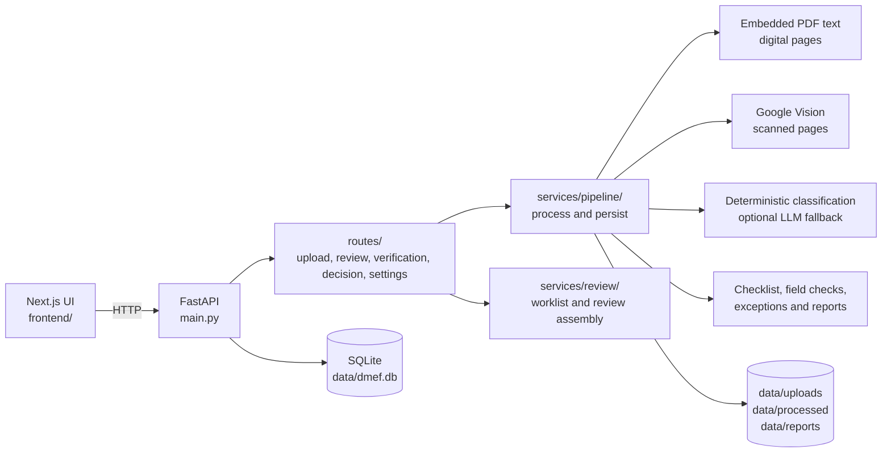

# Document Validation MVP

DMEF (Document Matching Early Finder) is a local FastAPI + Next.js application
for reviewing loan-file documents. It accepts PDF, ZIP-package, or partner OCR
JSON input, extracts or receives document evidence, evaluates the configured
checklist, and surfaces exceptions for human review.

This repository is an MVP for local development. The canonical setup path is
the quickstart below. Use [`run.md`](run.md) for starting, stopping, and
troubleshooting an already-installed checkout; use
[`docs/MAINTAINING.md`](docs/MAINTAINING.md) for backend ownership and quality
checks.

## What a successful first run looks like

There are two independent checks:

1. The local prerequisite check confirms Python, required imports, paths, and
   the checklist file.
2. The running API check confirms that FastAPI started and initialized the
   local SQLite schema.

After those checks, the browser UI can be opened. A fresh checkout does not
contain an approved sample PDF, so document-processing tests need a dummy or
approved document supplied separately.

## Architecture



The normal pipeline is asynchronous after upload: the upload route queues a
job, the pipeline processes pages and persists progress, and the UI polls the
progress and review endpoints. Digital PDF pages use embedded text. Scanned
pages use Google Vision by default. Local PaddleOCR is available only through
an explicit developer test path described below.

## Repository map

| Path | Responsibility |
|---|---|
| `main.py` | FastAPI application, startup schema initialization, CORS, and `/health`. |
| `routes/` | HTTP request validation and response serialization for upload, review, verification, decisions, and settings. |
| `services/pipeline/` | Page preparation, extraction/classification orchestration, validation, and persistence. |
| `services/` | OCR routing, text/field extraction, document classification, checklist evaluation, reports, configuration, and review helpers. |
| `services/review/` | Read-oriented worklist, comparison, summaries, and repository boundary for review data. |
| `database/` | SQLite connection helpers and schema/data models. |
| `frontend/` | Next.js 14 App Router UI, TypeScript, Tailwind, TanStack Query, and Zod. |
| `data/` | Tracked checklist/registry definitions plus ignored local database, uploads, processed pages, reports, and logs. |
| `docs/` | Architecture, policy, change, and example-manifest documentation. |

## Prerequisites

- Python **3.11.x**. The backend rejects other Python minor versions; the
  project metadata also requires `<3.12`.
- Node.js **20+** and npm for the Next.js UI.
- Git.
- For scanned-page processing: a Google Cloud project with the Vision API
  enabled and billing configured, plus either an API key or Application Default
  Credentials (ADC). Digital pages do not make a Google Vision request.
- Ollama is optional for the normal backend/UI startup. It is needed only for
  the optional local LLM modes or the macOS launcher.

If you only need to confirm that the app starts, you do not need Google
credentials or Ollama. The prerequisite check can skip the optional Ollama
probe, and the API health endpoint does not call either provider.

## Canonical quickstart

Run these commands from the repository root. Keep the terminal in the Python
3.11 virtual environment for backend commands.

### macOS

Create the environments and run the prerequisite check:

```bash
python3.11 -m venv .venv
source .venv/bin/activate
python -m pip install -r requirements.txt
npm --prefix frontend ci
cp .env.example .env
python -m services.local_health --no-ollama
```

Start the backend in Terminal 1:

```bash
source .venv/bin/activate
python -m uvicorn main:app --reload --host 127.0.0.1 --port 8000
```

Start the frontend in Terminal 2:

```bash
npm --prefix frontend run dev -- -p 3000
```

Verify the first successful API path:

```bash
curl -fsS http://127.0.0.1:8000/health
```

Expected response:

```json
{"status":"ok","version":"0.1.0"}
```

Open <http://localhost:3000>. API documentation is available at
<http://127.0.0.1:8000/docs> and ReDoc at
<http://127.0.0.1:8000/redoc>.

### Windows PowerShell

The supported setup script creates `.venv`, installs backend and frontend
dependencies, creates `.env` when missing, creates local data folders, and runs
the prerequisite check:

```powershell
.\setup.ps1
```

Start both services:

```powershell
.\run_local.ps1
```

Verify the first successful API path from another PowerShell window:

```powershell
Invoke-RestMethod http://127.0.0.1:8000/health
```

Expected response:

```text
status version
------ -------
ok     0.1.0
```

Open <http://localhost:3000>. The script prints process IDs, URLs, and log
paths. Stop the services later with:

```powershell
.\stop_local.ps1
```

`run_local.ps1` and `stop_local.ps1` force-stop listeners on the requested
ports. Confirm that ports `8000` and `3000` are owned by DMEF before using them
on a machine running other local services.

### Fresh-checkout health output

Before the first backend start, `services.local_health` may report a `WARNING`
for the database or processed-page directory because they are created lazily.
It may also log that `system_settings` does not exist yet while reading optional
settings. This is expected on a fresh checkout: `--fail-on-error` returns
non-zero only for required errors, and the backend creates the SQLite schema on
startup.

## Optional runtime modes

### Google Vision OCR for scans

`OCR_PROVIDER=google_vision` is the implemented application OCR provider. For
each scanned page, the backend sends one image to Google Vision and reuses that
result for classification and field extraction. A digital page uses its
embedded PDF text instead and does not incur an OCR API request.

The health command checks that the Google Vision Python module is importable; it
does **not** validate billing, permissions, credentials, or a live OCR request.
The first real scanned-page run is the credential check.

The `.env.example` value `GOOGLE_VISION_AUTH=auto` uses an API key when one is
configured and otherwise uses ADC. Set `api_key` or `adc` explicitly when you
need to force one path. Once the database has been initialized, the Settings
UI's database-backed OCR setting can take precedence over a copied `.env`.

#### API-key authentication

Put the key in the ignored `.env` file or use the Settings UI. Never put a real
key in a tracked file, issue, screenshot, or commit.

```dotenv
OCR_PROVIDER=google_vision
GOOGLE_VISION_AUTH=api_key
GOOGLE_VISION_API_KEY=replace_with_your_secret_key
GOOGLE_VISION_FEATURE=DOCUMENT_TEXT_DETECTION
```

#### ADC or service-account authentication

Keep the credential file outside the repository and use an absolute path:

macOS:

```dotenv
OCR_PROVIDER=google_vision
GOOGLE_VISION_AUTH=adc
GOOGLE_APPLICATION_CREDENTIALS=/Users/your-user/.config/dmef/google-vision.json
```

Windows (forward slashes avoid `.env` escaping surprises):

```dotenv
OCR_PROVIDER=google_vision
GOOGLE_VISION_AUTH=adc
GOOGLE_APPLICATION_CREDENTIALS=C:/Users/your-user/.config/dmef/google-vision.json
```

With the Google Cloud CLI, this command creates/uses ADC for the current user:

```text
gcloud auth application-default login
```

When using ADC created by that command, leave
`GOOGLE_APPLICATION_CREDENTIALS` blank. Restart the backend after changing
`.env`. The Settings page can show the selected OCR mode and stores secret
settings without returning the secret value.

### Ollama and other LLM providers

LLM calls are optional. `LLM_PROVIDER` supports these effective modes:

| Value | Behavior |
|---|---|
| `none` | Disable shared LLM calls. Useful for a no-network local smoke run. |
| `ollama` | Use the local/explicit Ollama endpoint and configured model. |
| `auto` | Use an API-key provider when a key is present; otherwise use Ollama. This is the `.env.example` default. |
| `openai` / `openai_compatible` | Use an API-key-backed `/chat/completions`-compatible endpoint. |

Ollama is not required to start FastAPI or the UI. If it is unavailable, the
optional classifier path logs the failure and standard classification continues.
Set `LLM_PROVIDER=none` in `.env` when you want to make that choice explicit.
Do not assume that an LLM response is ground truth: deterministic matching and
validation remain the source of truth, and the structured classifier does not
replace the deterministic document type.

#### macOS laptop launcher

The convenience launcher is intentionally not the canonical credential-free
quickstart:

```bash
./scripts/start_mvp.sh
```

It requires the `ollama` command, starts Ollama when needed, pulls the models
configured by the environment, forces laptop-friendly settings, and starts the
backend and frontend in the background. It also force-stops any process
listening on ports `8000` and `3000`. Logs are written to
`data/logs/ollama.log`, `data/logs/uvicorn.log`, and
`data/logs/frontend.log`. Use it only when that behavior is wanted.

### Isolated offline PaddleOCR smoke test

Normal application setup does not install PaddleOCR. The isolated test path is
for local OCR experiments only and does not call Google Vision:

```bash
python3.11 -m venv .venv-ocr
source .venv-ocr/bin/activate
python -m pip install -r requirements-ocr-local.txt
python scripts/test_offline_ocr.py /absolute/path/to/sample.pdf --page 1 --lang hi
```

On Windows PowerShell, activate with
`.\.venv-ocr\Scripts\Activate.ps1` and run the same `pip` and `python` commands.
The script sets `DMEF_LOCAL_OCR_TEST_MODE=true` and `OCR_PROVIDER=local` for
itself. The full backend must have both values explicitly set to use local OCR;
`OCR_PROVIDER=local` alone is intentionally ignored outside test mode. The
first local OCR run may download Paddle models.

The local adapter has no dedicated PaddleOCR v5 recognizer for Gujarati,
Bengali, Gurmukhi, Odia, Kannada, or Malayalam. Use Google Vision for those
scripts in the application.

## Main UI workflows

- **Document Intake → Automatic Verification**: upload a PDF, or prepare a ZIP
  package, and let the shared pipeline identify document types, group
  continuation pages, and infer ownership. Trusted people data can be supplied
  using [`docs/mapped_manifest.example.json`](docs/mapped_manifest.example.json).
- **Document Intake → Mapped Verification**: upload a PDF or ZIP and provide a
  manifest. `pages` values are one-based PDF page numbers; the supplied
  `document_type` and person mapping are used instead of automatic type
  prediction. Match/mismatch decisions are deterministic.
- **Partner OCR JSON**: submit an already-extracted partner payload directly to
  the checklist path.
- **Worklist / Application Review / My Activity**: inspect queued and completed
  applications, evidence, anomalies, checklist status, decisions, and activity.

For multilingual documents, script observations and language identification are
separate evidence. Do not infer a specific language from a script alone; see
[`docs/multilingual_document_policy.md`](docs/multilingual_document_policy.md)
for the current evidence and decision model.

For mapped verification, the manifest is sent as multipart form data to
`POST /upload/mapped`; the upload response contains progress and summary URLs.
See the interactive API docs for the exact request schema.

## Configuration and local data

The defaults are relative to the repository root:

| Purpose | Variable | Default |
|---|---|---|
| SQLite database | `DATABASE_PATH` | `data/dmef.db` |
| Uploaded PDFs and ZIP packages | `UPLOAD_DIR` | `data/uploads` |
| Rendered pages and OCR JSON | `PAGE_OUTPUT_DIR` | `data/processed` |
| JSON and Excel reports | `REPORT_OUTPUT_DIR` | `data/reports` |
| Checklist definition | `CHECKLIST_JSON_PATH` | `data/checklist.json` |
| Frontend API base URL | `NEXT_PUBLIC_API_BASE_URL` | `http://127.0.0.1:8000` |

The older `DATABASE_URL=sqlite:///...` form remains accepted for legacy local
`.env` files. `.env.example` contains the other runtime switches, including
upload/ZIP limits, OCR timeouts, validation profiles, and job-control settings.
Do not copy a real database or real customer data into the repository.

## Known MVP limitations

- This is a local-development application, not a production deployment. There
  is no general application authentication layer in the routes; keep services
  bound to loopback and do not expose them to an untrusted network.
- A live scanned-document run depends on Google Vision credentials, network
  access, API enablement, and billing. The health check cannot prove any of
  those conditions.
- Offline OCR is an isolated PaddleOCR developer path, not the normal provider
  and not a complete cross-India language solution.
- Optional LLM features are best-effort fallbacks/signals. They can be disabled
  or unavailable without turning a deterministic result into an LLM result.
- A fresh checkout has no approved sample PDF, and this documentation does not
  claim that a full OCR/checklist result can be verified without one.
- The default local SQLite database and generated artifacts are not a shared
  service. Separate checkouts have separate data unless their paths are
  deliberately configured to point elsewhere.

## Data handling

Use only dummy or explicitly approved documents during development. Uploads,
rendered pages, OCR text/JSON, reports, the local database, `.env`, Google
credentials, API keys, and Ollama-generated local data may contain sensitive
information or secrets. Keep them outside commits and outside screenshots.

The repository `.gitignore` excludes `.env`, databases, PDFs/images, runtime
uploads, processed pages, reports, caches, and logs. Treat that as a guardrail,
not as a substitute for checking what you are about to stage:

```bash
git status --short --ignored
git diff --check
git diff --cached --stat
git diff --cached
```

Before sharing an output or asking for review, confirm that it contains no
applicant identifiers, document images, credential paths, tokens, or API keys.
