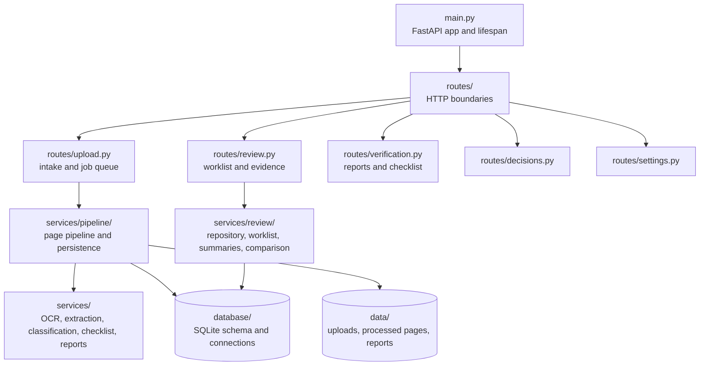

# Maintaining DMEF

This note is the backend contributor map. Start with the
[`README.md`](../README.md) quickstart, then use this file for ownership,
runtime paths, and quality checks. Keep the MVP behavior-preserving: prefer a
small focused change over a broad package move.

## Backend architecture



### Ownership rules

- `main.py` owns application wiring, lifespan initialization, CORS, and the
  small `/health` endpoint. It should not own document-processing logic.
- `routes/` validates request parameters, calls a service, and translates
  expected domain errors to HTTP responses. Preserve existing response keys
  when changing a route.
- `services/pipeline/` is the current source of truth for processing order,
  checkpoints, persistence, and pipeline outcomes.
- `services/review/repository.py` owns review SQL. Worklist, comparison, and
  document-summary assembly belongs in the matching `services/review/` module.
- The top-level validation modules such as `services/checklist_engine.py`,
  `services/consistency_checks.py`, `services/field_extractor.py`, and
  `services/person_ownership.py` remain compatibility facades for existing
  imports and monkeypatch targets. Keep them unless the migration is proved
  behavior-preserving.
- `database/` owns schema statements, connections, and shared data models.
  `services/paths.py` is the single source for environment-driven filesystem
  locations.
- `frontend/` is a separate Next.js application. Backend changes that alter a
  payload must be checked against `frontend/lib/api.ts` and its consumers.

The generated domain split described in older planning notes is not the
maintained source of truth. Do not reintroduce a large generated package move
without a separate, tested migration plan.

## Runtime paths

Paths default relative to the repository root and are resolved by
`services.paths`:

| Purpose | Environment variable | Default |
|---|---|---|
| SQLite database | `DATABASE_PATH` | `data/dmef.db` |
| Uploaded PDFs and ZIP packages | `UPLOAD_DIR` | `data/uploads` |
| Rendered pages and OCR JSON | `PAGE_OUTPUT_DIR` | `data/processed` |
| Reports | `REPORT_OUTPUT_DIR` | `data/reports` |
| Checklist definition | `CHECKLIST_JSON_PATH` | `data/checklist.json` |

The legacy `DATABASE_URL=sqlite:///...` value is still accepted for older local
`.env` files. Runtime databases, uploads, rendered pages, OCR output, reports,
logs, credential files, and `.env` are ignored by Git, but they still need
careful handling. Existing sample/data artifacts are not disposable merely
because they are local; confirm ownership before removing anything.

## Configuration boundaries

- Google Vision is the normal OCR provider for scanned pages. Digital PDF text
  is extracted without an OCR API call.
- Local PaddleOCR is intentionally isolated behind
  `DMEF_LOCAL_OCR_TEST_MODE=true` and is not installed by `requirements.txt`.
- LLM providers are optional. `LLM_PROVIDER=none` is the explicit no-LLM mode;
  `auto` chooses an API-compatible provider when a key exists and otherwise
  chooses Ollama. Do not put keys in source, tests, fixtures, or documentation.
- The Settings UI writes selected settings to the local SQLite table. Secret
  values are masked in API responses; do not infer that masking makes the local
  database safe to share.
- When changing a setting, check both `.env.example` and the database-backed
  setting path. UI-managed settings can take precedence over copied `.env`
  values.

## Setup and health check

Use the root README quickstart. For a backend-only check with an active Python
3.11 environment:

```bash
python -m services.local_health --no-ollama --fail-on-error
```

This checks the Python minor version, importable PyMuPDF and Google Vision
modules, configured paths, and the checklist file. It does not authenticate to
Google Vision, run OCR, or validate an Ollama model. A fresh checkout may show
warnings until FastAPI creates the SQLite schema and processed-page directory.

## Quality checks before a backend commit

Run from the repository root with `.venv` active:

```bash
python -m pytest -q
python -m compileall -q main.py database routes services tests
ruff check routes/review.py services/paths.py services/review tests/test_paths.py tests/test_compatibility_facades.py tests/test_review_boundary.py tests/test_low_memory.py
ruff format --check routes/review.py services/paths.py services/review tests/test_paths.py tests/test_compatibility_facades.py tests/test_review_boundary.py tests/test_low_memory.py
mypy services/paths.py services/review
git diff --check
```

For frontend-facing changes, also run from the repository root:

```bash
npm --prefix frontend run typecheck
npm --prefix frontend run lint
npm --prefix frontend run build
```

On Windows PowerShell, use `npm.cmd --prefix frontend ...` and
`python -m ...` after activating `.venv`. These checks use the tools listed in
`requirements.txt` and the scripts listed in `frontend/package.json`.

## Safe change workflow

1. Read the relevant route/service and its tests before editing.
2. Keep observed document values, resolved metadata, and trusted input separate.
   Do not make trusted JSON overwrite observed OCR evidence.
3. Add or update focused tests for runtime behavior; do not use live Google,
   Ollama, or other external services in tests.
4. Run the smallest relevant check while iterating, then run the full checks
   above before committing.
5. Inspect `git status --short --ignored`, `git diff --check`, and staged diff
   content for documents, identifiers, secrets, and generated output.

See [`CONTRIBUTING.md`](../CONTRIBUTING.md) for the contributor checklist.
