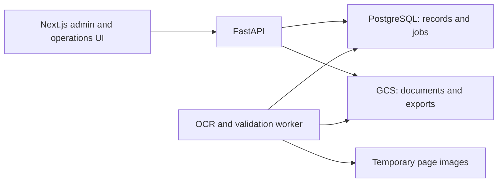

# PR 26 review and migration guide

Review date: 9 September 2026. The validation described here was performed locally before submission. No production deployment or customer-data deletion was performed. Consult PR 26 for the subsequent commit and merge status. Code repairs were implemented through OpenCode with `opencode/muse-spark-1.3-contributor-free`, variant `xhigh`, and independently checked in Codex.

## What the code is, and where it lives

DMEF is a document intake and review application: Next.js provides admin and operations screens; FastAPI accepts documents and serves review data; a durable worker performs PDF/OCR extraction and validation. PostgreSQL stores users, jobs, pages, findings and audit records. Google Cloud Storage stores source documents and generated exports. Cloud Run deployment configurations cover the API and worker.

**GCS is object storage, not a vector database.** No embedding/index/vector-search implementation was found. If semantic retrieval is a product requirement, that remains separate work.

- [PR 25](https://github.com/UddhavB17/document-validation-mvp/pull/25) already merged the larger production pilot foundation into main on 6 September 2026.
- [PR 26](https://github.com/UddhavB17/document-validation-mvp/pull/26) is an open follow-up, originally titled “Fix SQLite URL handling and remove duplicate CI runs”. Its original scope is cleanup, not the entire PostgreSQL migration.
- Reviewed PR head: `5eba0115bed6b3ab8cac5a779b069035305c461c`; base main: `252b1746e5958674467d15804680cd764f3f652b`.
- Repairs were prepared in `.worktrees/main-cleanup`, branch `codex/main-cleanup`. The parent checkout remains on the older `cursor/production-next-phase-plan-3e3f` branch, with unrelated existing edits preserved.

## Storage finding

The old local data directory occupies roughly 19 GB. These measurements overlap and must not be added together:

| Location/content | Measured size |
|---|---:|
| Actual page OCR text in SQLite | About 73 MiB |
| `pages.structured_content` in SQLite | 3.636 GiB |
| 47 processed `document_ocr_data.json` files | 5.004 GiB |
| Processed PNG page images | 3.074 GiB |
| Uploaded files directory | About 4.7 GiB |

The hypothesis was substantially correct: large nested OCR/layout structures and retained page renders dominated storage, rather than ordinary extracted text. Sample exports repeated structures under `raw_ocr_pages`, `documents[*].page_details`, and `processing_event`.

PR 25 already removes durable page-image/structured-content storage for new processing and slims exports/events. Additional repairs make offline runs use disposable page work directories too, implement export expiry, and preserve references after failed object deletions so retention can retry. Active/resumable jobs are excluded from source deletion candidates. Reports remain retained reviewer data.

**Merging does not shrink the old archive.** No customer files or database rows were deleted. Before reclaiming old storage, make and verify a backup, confirm each retained source document and required review/audit evidence is recoverable, then separately approve an explicit cleanup manifest. Deleting SQLite fields alone does not necessarily return disk space; an offline database compaction/rebuild is a separate operation. Do not blindly remove `data/`, OCR caches, PDFs, or exports.

## Correctness and security repairs

- Session routes and protected navigation verify tokens against the backend rather than trusting decoded role claims. Unknown roles, fabricated/expired tokens and deactivated accounts fail closed. Backend outage returns 503 without destroying a valid session. Authenticated responses are private and not cached.
- Tokens require expiry and subject claims; malformed/missing claims are rejected.
- PDF evidence uses a constrained same-origin streaming endpoint, forwarding the session cookie as a backend bearer. This fixes images/downloads that previously omitted authorization. The backend continues to enforce admin-only original-PDF/OCR-export access.
- Approval and override decisions require positive evidence that processing completed. Decision writes and undo operations serialize on both database dialects; only the latest decision can be undone, and a preceding decision is restored correctly. Reviewer identity and audit records are saved atomically with changes.
- Temporary OCR work is cleaned on success/failure. Retention now expires OCR exports and retries failed object deletions without losing references.
- Docker build exclusions prevent local datasets, environment files, worktrees, agent artifacts and key files from entering the build context.
- Cloud Run no longer hardcodes retired `gemini-2.0-flash`; both services use an operator-selected `dmef-gemini-model` secret. Google lists that model as shut down on 1 June 2026: [official deprecations](https://ai.google.dev/gemini-api/docs/deprecations).
- Neon instructions now compare `alembic current` with `heads`; `alembic check` cannot validate this repository because autogenerate metadata is absent.

## Remaining production gates

Passing tests does not prove cloud deployment, OCR quality, data retention policy, or complete security readiness.

1. Provision and test real staging Neon/GCS/Cloud Run/Secret Manager integration; no live cloud smoke test was run here. A full container build was not validated locally.
2. Select and evaluate a currently supported Gemini model on representative documents before provisioning its secret. Do not silently assume model replacements preserve extraction quality.
3. Decide and implement the required session invalidation policy. Existing bearer tokens remain valid for up to 12 hours after logout or password change; deactivation is checked per request. Login throttling is process-local, so multi-instance deployment needs an explicit abuse-control strategy.
4. Confirm the intended operations workflow: current operations UI provides findings and page evidence, while decision APIs support writes. Do not assume every backend action has a completed operations screen.
5. Approve source/export retention periods against actual operational needs. Exercise retention in dry-run mode before enabling deletion schedules.

6. ZIP package preparation still runs in a daemon thread in the API process before durable pipeline verification begins. API instance restart can interrupt preparation; harden this stage and test Cloud Run lifecycle behaviour before relying on production ZIP intake.

## Merge and migration sequence

1. Review the complete diff in `.worktrees/main-cleanup`, including untracked files and dependency lockfile. Do not stage unrelated edits from the parent checkout.
2. Commit the reviewed repair files on `codex/main-cleanup`, then push that existing PR branch to update PR 26. Refresh the PR title and description to describe its expanded final scope and attach the new verification results. This is the submission sequence; consult PR 26 for its current status.
3. Wait for fresh SQLite/PostgreSQL CI, frontend checks and quality checks on the new commit. The green checks on original PR head `5eba0115` do not cover these repairs. Merge PR 26 only after review and these checks pass.
4. Use a fresh checkout of merged `origin/main` for release. Do not merge the older planning branch or blindly pull the divergent parent checkout.
5. Follow the accepted plan in `docs/PRODUCTION_NEXT_PHASE.md`: start a **new empty Neon database** and re-upload a controlled pilot set. Keep the laptop SQLite/data archive intact. If historical records must be preserved online, design and rehearse a separate ETL migration with identity, object-key, count and audit reconciliation; no such historical-data migration was performed here.
6. Provision a staging GCS bucket and least-privilege runtime access. Set the documented database, authentication, encryption, scheduler, bootstrap and Gemini secrets. Set the frontend build-time API URL to the staging API and configure its server backend URL consistently.
7. Against the **direct** Neon endpoint, run `DATABASE_URL=<direct-url> alembic upgrade head`, then compare `alembic current` and `alembic heads`. The local test database reached `0005_batch_rejections`. Use pooled database connections for the API and worker runtime.
8. Inspect `PROJECT_ID=<project> REGION=<region> TAG=<tag> bash scripts/release.sh --dry-run`. Build and deploy the reviewed images to staging using the release guide. Verify database, storage and worker health, not just HTTP reachability.
9. Run the documented ten-PDF smoke batch. Exercise admin/operations login, hard refresh, role restrictions, upload-to-review, page evidence, worker restart/retry, duplicate retries, approval/undo and retention dry-run. Compare OCR results to the documents manually.
10. Promote only after the staging evidence and remaining production gates are resolved. Keep previous images and a database backup available; schema rollback is not automatically safe after new writes.

Deployment references: `docs/DEPLOY_NEON.md`, `deploy/cloudrun/README.md`, and `scripts/release.sh` in this checkout.

## Verification evidence

- Independent full SQLite suite: **1,006 passed, 2 skipped**.
- Independent full PostgreSQL suite against a disposable local PostgreSQL 18 database: **1,006 passed, 2 skipped**.
- Applied PostgreSQL Alembic revision and repository head both report **`0005_batch_rejections`**.
- Ruff and `git diff --check` passed.
- Browser testing uses only synthetic users, records and a synthetic PDF, never customer data. Initial checks confirmed login, admin/operations navigation differences, operations redirect away from admin pages, sign-out, and authenticated page evidence rendering. The browser check identified the hydration race, which OpenCode then corrected by holding protected queries until the bearer is ready.

- Independent frontend verification: **78 tests passed**, TypeScript and ESLint clean, production build passed on **Next.js 15.5.25**.
- Full dependency audit (production and development): **zero reported vulnerabilities**, independently verified after upgrading Next.js and patching PostCSS/nanoid and compatible development dependencies. Next.js 14 is outside support; the update uses maintained Next.js 15 with compatible React 18. See [support policy](https://nextjs.org/support-policy) and [August security release](https://nextjs.org/blog/august-2026-security-release).
- Final browser checks on the updated framework passed: hard navigation to an admin page as operations redirects to a working operations queue without logout; hard loading the case page preserves the session; the evidence image loads through the new endpoint at 1,240 pixels wide.
- The synthetic API health indicator was degraded because no worker was started for this UI-only fixture. This is not a successful worker or cloud-health test. Its sidebar endpoint label is also hardcoded to localhost and should be corrected before relying on it operationally.

## Verdict

The repaired code is suitable to take through review, fresh PR CI and a staging pilot. **It is not yet verified production-ready.** The tests support the repaired behavior, while the production gates above remain necessary. Review the final PR diff and checks; merging these repairs does not satisfy the remaining production gates.

Local test services and the disposable PostgreSQL instance were stopped after verification. The repair checkout now has its own frontend dependency installation; the original shared installation was preserved.
