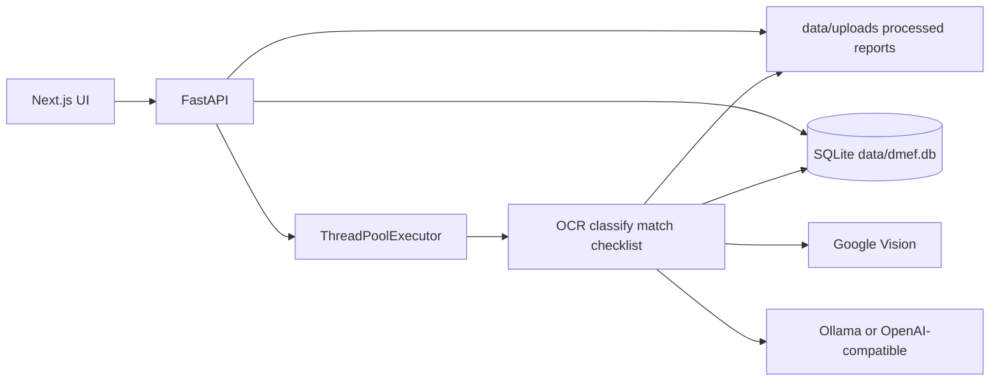
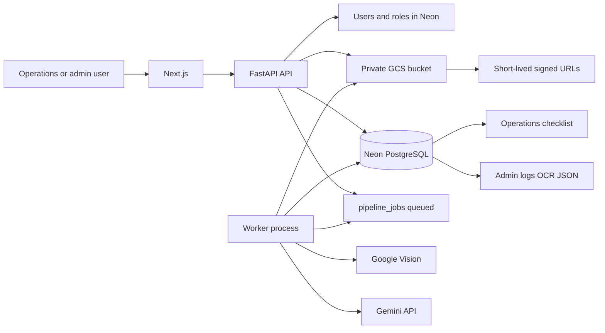

# Production next phase: how to implement it on this codebase

This is an implementation plan for taking DMEF from a working local prototype
to a production-ready document review service. It maps the team discussion onto
the current repository (`main` at PR #22) and says what to reuse, what to
replace, and in what order.

Credit scoring, overnight batch scheduling, and PWS work stay out of this
phase. They are listed at the end so they are not forgotten.

## Current system in one paragraph

DMEF is a FastAPI + Next.js app. A user uploads a PDF or ZIP. The API writes
the file under `data/uploads/`, inserts SQLite rows, and hands work to an
in-process `ThreadPoolExecutor`. The pipeline renders pages, OCRs scanned
pages with Google Vision, classifies them, compares extracted fields with
trusted application data, evaluates `data/checklist.json`, and writes OCR
text, anomalies, summaries, and reports to SQLite plus `data/processed/` and
`data/reports/`. The Next.js UI then polls progress and shows a single case
workspace with review, extracted data, checklist, processing logs, and file
downloads. There is no login, no role split, and no durable queue.



## What already matches the production discussion

Do not rebuild these. Production work should wrap or expose them.

| Need from the discussion | Already in the repo |
|---|---|
| ZIP/PDF intake | `routes/upload.py`, `services/zip_package.py` |
| OCR | Google Vision via `services/ocr_router.py` / `services/google_vision_ocr.py` |
| Compare with trusted application data | `services/mapped_verification.py`, `services/field_verification.py`, `services/trusted_reconciliation.py` |
| Cross-document checks | `CROSS_DOCUMENT_*` rules, `services/consistency_checks.py` |
| Checklist in the MSFC NDC format | `data/checklist.json`, `frontend/components/applications/Checklist.tsx` |
| Name / PAN / address / missing-doc / bank recency / blurry / OCR failure | Existing rule IDs (see [Anomaly categories](#anomaly-categories-map-do-not-rewrite-the-engine)) |
| Collapse noisy per-page flags | `services/reviewer.py` |
| Per-file status and progress | `pipeline_jobs`, `pipeline_progress`, `frontend/components/ProgressPanel.tsx` |
| Manual retry / resume | `services/reprocessing.py`, `/review/applications/{id}/restart` |
| Click-through to a page with a highlight | `routes/review.py` `source-page` + `highlight=` query |
| Reviewer summary and pages to check | `reviewer_summaries`, `ReviewerSummary.tsx` |
| Case tabs that can be split by role | Review vs Extracted vs Checklist vs Processing vs Files |
| Sequential processing | `DMEF_PIPELINE_WORKERS` defaults to 1 |

The prototype is feature-rich. It is not production-shaped: storage, database,
process lifetime, and access control are all bound to one machine.

## Gaps that block production

| Requirement | Current behavior | Why it fails in production |
|---|---|---|
| Private cloud storage | Local paths in `uploaded_files.file_path`, `pages.image_path`, `intake_packages.*_path`, `data/reports/` | Files vanish if the process or disk dies; a second instance cannot see them |
| Neon / hosted PostgreSQL | `database/db.py` is SQLite-only (`sqlite3`, `PRAGMA`, `AUTOINCREMENT`, `INSERT OR IGNORE`, `?` placeholders) | Cannot share state across API and workers; not reachable from a deployed host |
| Durable one-at-a-time queue | `services/job_runner.py` is an in-process thread pool | Jobs are lost on restart; two API replicas would double-process; no fair batch queue |
| Results as soon as each file finishes | One upload = one application, and that part is already incremental | The UI only accepts **one** PDF/ZIP per submit. There is no batch of 10 |
| Auto-retry 3 times then stop with a reason | `pipeline_jobs.attempt` exists; retries are **manual** | Operators have to click restart; no hard stop after 3 failures |
| Admin vs operations UI | One shell: Upload, Worklist, Activity, Settings, plus technical tabs | Operations users see OCR JSON, processing logs, rule IDs, dumps |
| Login and admin-managed users | None. `DMEF_JOB_CONTROL_TOKEN` is a shared recovery secret | Anyone who can reach the UI can upload, view KYC, and change settings |
| English/Hindi operations summary | LLM summary is English TOON JSON; Hindi exists in OCR/classifier, not in the review copy | No language toggle for operations |
| Highlights on the **image** | Highlight is PDF text search (`page.search_for`) plus OCR text `<mark>` | Scanned pages often have no selectable PDF text; stored Vision bounding boxes are unused in the viewer |
| Gemini model bakeoff | Settings dropdown includes `gemini`, but `services/llm_client.py` only implements Ollama and OpenAI-compatible HTTP | Selecting Gemini does not call Gemini |
| Deployed app without the laptop | CORS locked to localhost; paths are relative; no Docker/Cloud Run worker | Health check can pass while processing cannot |

SQLite is used from at least these runtime modules: `database/db.py`,
`routes/upload.py`, `routes/review.py`, `routes/decisions.py`,
`routes/settings.py`, `routes/verification.py`, `services/pipeline/persistence.py`,
`services/progress_tracker.py`, `services/job_control.py`,
`services/reprocessing.py`, `services/review/repository.py`,
`services/config.py`, `services/audit_service.py`. Any database move has to
go through a shared connection layer, not a one-file swap.

## Target production shape



Keep the current pipeline (`services/pipeline/orchestrator.py`) as the
processor. Change **where files live**, **where rows live**, **who may see
them**, and **how jobs are started**.

Recommended hosting (fits existing Google Vision + service-account work):

- **Files:** Google Cloud Storage, private bucket, HMAC or IAM, signed GET URLs
- **Database:** Neon PostgreSQL, `DATABASE_URL` from the environment
- **API:** Cloud Run or equivalent, stateless
- **Worker:** separate Cloud Run service / VM process, one replica, long timeout
- **Secrets:** Secret Manager or the host’s secret store, never `.env` on disk
  in production

A local `/tmp` working directory during a job is still required (PyMuPDF and
Vision need files). That is not durable storage. Download → process → upload
results → delete the temp tree. Do not write under the repo’s `data/` folder
in production.

## Decisions the team still needs to lock

These are product choices, not code mysteries. Defaults below are what the
implementation should use if nobody overrides them before 10–11 September.

1. **Retention.** Transcript mentioned both 10–15 days and two months.
   **Default:** 60 days for source ZIP/PDF (pilot reviewers need history);
   15 days for rendered page images (they can be regenerated from the source);
   60 days for structured Neon rows. Encode as `DMEF_RETENTION_SOURCE_DAYS`
   and `DMEF_RETENTION_PAGE_DAYS`. A later cleanup job enforces this; do not
   block the first deploy on the cleanup job itself.
2. **Object store.** **Default: GCS.** The OCR path already uses Google ADC /
   API keys. S3 is a backend interface, not the first implementation.
3. **Queue backend.** **Default: Postgres `FOR UPDATE SKIP LOCKED` on
   `pipeline_jobs`.** Neon is already required. Redis/Celery adds another
   moving part before the pilot.
4. **Auth.** **Default: email + password, admin-created accounts, JWT or
   httpOnly session cookie.** SSO can wait until after the credit-team pilot.
5. **Gemini default after bakeoff.** Do not hard-code a model until the sample
   file eval runs. Wire the provider first; pick the model from the eval table.

## Implementation sequence

Build in this order. Each step is deployable without the next. Do not start
scheduler or PWS work in this list.

### 1. Object storage (bucket + stop using `data/` as the system of record)

**Add** `services/storage/__init__.py` with a small interface:

- `put(key, bytes, content_type) -> key`
- `get(key) -> bytes`
- `signed_url(key, seconds) -> str`
- `delete(key)`

**Implement** `LocalObjectStore` (tests / laptop) and `GcsObjectStore`
(production). Select with `DMEF_STORAGE_BACKEND=local|gcs` and
`DMEF_GCS_BUCKET`.

**Key layout:**

```text
applications/{application_id}/source/{original_filename}
applications/{application_id}/packages/{package_id}/source.zip
applications/{application_id}/packages/{package_id}/normalized.pdf
applications/{application_id}/pages/{page_number}.png
applications/{application_id}/ocr/{application_id}.json
applications/{application_id}/reports/{name}.json
tmp/{job_id}/...          # never the system of record
```

**Change call sites that write or read paths today:**

| Today | After |
|---|---|
| `routes/upload.py` `_save_upload_stream` → `UPLOAD_DIR` | Stream to GCS (resumable or buffered), store object key in `uploaded_files.storage_key` |
| `services/zip_package.py` extract + `normalized_pdf_path` | Extract in `/tmp`, upload ZIP + normalized PDF, persist keys on `intake_packages` |
| `services/pdf_processor.py` page PNGs | Render to `/tmp`, upload PNG, store key on `pages.image_path` (or `image_storage_key`) |
| `services/ocr_json_export.py` `save_ocr_document_json` | Put JSON in GCS **and** `pages.ocr_text` / `document_verification_reports` in Neon |
| `services/report_generator.py` Excel/JSON under `data/reports` | Store JSON in Neon (`document_verification_reports`, `reviewer_summaries`); Excel is an on-demand export from Neon, optional object |
| `routes/review.py` `FileResponse(file_path)` | Redirect or stream via signed URL; page images from GCS, not disk |

Keep a short-lived signed URL (5–15 minutes) for the evidence viewer. Do not
make the bucket public.

**Temp RAM/disk:** `DMEF_JOB_WORK_DIR=/tmp/dmef-jobs/{job_id}`. Delete in a
`finally` block in the worker. Page-level OCR still checkpoints into Neon so a
retry does not need the temp tree.

### 2. Neon PostgreSQL (move the database, not the domain model)

**Do not** keep `sqlite3.connect` and hope a connection string is enough.

**Add** SQLAlchemy 2.x + psycopg (v3) + Alembic.

**Replace** `database/db.py` with an engine/session factory driven by
`DATABASE_URL`:

- Production: `postgresql://...@....neon.tech/neondb?sslmode=require`
- Local/tests: `sqlite+pysqlite:///...` **or** a Neon branch, but tests should
  not require network. Prefer SQLite in pytest through the same SQLAlchemy
  models so the schema does not fork.

**Schema translation** from `database/models.py` `SCHEMA_STATEMENTS`:

| SQLite | PostgreSQL |
|---|---|
| `INTEGER PRIMARY KEY AUTOINCREMENT` | `BIGINT GENERATED BY DEFAULT AS IDENTITY` |
| `BOOLEAN` stored as 0/1 | `BOOLEAN` (frontend already accepts both in `pageSchema`) |
| JSON in `TEXT` (`extracted_fields`, `report_json`, `summary_json`, `raw_json`) | `JSONB` |
| `INSERT OR IGNORE` | `ON CONFLICT DO NOTHING` |
| `PRAGMA foreign_keys / WAL` | drop; Neon handles this |
| `CURRENT_TIMESTAMP` | `TIMESTAMPTZ DEFAULT now()` |
| `?` placeholders | SQLAlchemy bound params |

**New columns (additive, needed by storage and queue):**

- `uploaded_files.storage_key`, `storage_backend`, `content_type`
- `pages.image_storage_key` (keep `image_path` during dual-read)
- `intake_packages.source_zip_key`, `normalized_pdf_key`
- `pipeline_jobs.failure_reason`, `max_attempts` (default 3), `next_run_at`
- `applications.ops_summary_en`, `ops_summary_hi`, `ops_findings_json`
- `users`, `user_credentials` (see auth)

**Alembic** becomes the only schema writer. Stop running ad-hoc
`MIGRATION_STATEMENTS` `ALTER TABLE ... ADD COLUMN` on startup. `init_db()`
can stay for tests; production uses `alembic upgrade head`.

**Env:** add `DATABASE_URL` to `.env.example`. Treat `DATABASE_PATH` as local
dev only. Confirm after cutover:

- insert application + uploaded file + job
- worker writes pages, OCR text, validation_results, reviewer_summaries
- API on a **different** process reads them
- `/health` reports `database: ok` without touching the developer laptop

### 3. Durable queue and batch upload

**Keep** the `pipeline_jobs` / `pipeline_progress` tables. **Replace**
`services/job_runner.py` `ThreadPoolExecutor`.

**Worker loop** (`python -m services.worker`):

1. `BEGIN`
2. `SELECT ... FROM pipeline_jobs WHERE status = 'queued' AND next_run_at <= now() ORDER BY id FOR UPDATE SKIP LOCKED LIMIT 1`
3. Set `status = 'running'`, heartbeat
4. `COMMIT`
5. Download objects to the job work dir
6. Call existing `run_pipeline(...)`
7. On success: `completed`, persist summary immediately, delete temp dir
8. On failure: increment `attempt`; if `attempt < 3`, set `queued` +
   `failure_reason` + backoff `next_run_at`; else `failed` and freeze the
   reason for the UI

Heartbeats already exist (`DMEF_JOB_HEARTBEAT_GRACE_SECONDS`). Reuse
`services/reprocessing.py` stale detection so a dead worker does not leave
jobs running forever.

**One file at a time:** run **one worker replica**. Do not raise
`DMEF_PIPELINE_WORKERS` for the pilot. Memory and Vision timeouts are the
constraint, not throughput.

**Batch upload (the 10-file path):**

New API:

```http
POST /upload/batch
multipart: files[] (PDF or ZIP), plus either one shared manifest or per-file loan metadata
→ { "batch_id": "...", "items": [ { application_id, job_id, filename, status: "queued" } ] }

GET /upload/batch/{batch_id}
→ items with processing | completed | failed | retrying, attempt, failure_reason
```

Implementation notes:

- Create N `applications` and N `pipeline_jobs` in one request after all
  objects are stored.
- Do **not** wait for pipeline completion in the HTTP request.
- Each job writes `reviewer_summaries` and `validation_results` when **that**
  file finishes. The worklist already lists applications independently;
  polling `GET /review/worklist` is enough for “show completed files early.”
- Frontend: `PdfUploadForm` / `MappedUploadForm` / `ZipPackageForm` today use
  a single `File`. Change the file input to `multiple`, show a per-file status
  table, and navigate into a case as soon as its `operational_status` is
  `completed` / `completed_with_warnings` / `failed`.

**Retry UX:** worklist already has `pipeline_retryable`. Extend it:

- `retrying` while `attempt` in 1..2 after a failure
- `failed` after attempt 3, with `error` shown in operations language
  (“Could not read this file after 3 tries: Google Vision timed out”)
- Admin may still force a fourth attempt via the existing restart route

Overnight “process everything uploaded today” is a Cloud Scheduler trigger
on the same worker query. **Do not build the scheduler in this phase.** The
queue table is the hook.

### 4. Authentication and two roles

**New tables:**

```text
users (id, email UNIQUE, display_name, role CHECK IN ('admin','operations'), is_active, created_at, created_by)
user_passwords (user_id PK, password_hash, updated_at)
```

**API:** FastAPI dependency `get_current_user`. Unauthenticated requests get
401 except `/health`. Admin-only: settings, user CRUD, raw OCR JSON, job
control, SQL-ish dumps.

**Admin APIs:**

```http
POST   /admin/users          { email, display_name, role, password }
PATCH  /admin/users/{id}     { is_active, role, password }
GET    /admin/users
```

First admin: bootstrap from `DMEF_BOOTSTRAP_ADMIN_EMAIL` +
`DMEF_BOOTSTRAP_ADMIN_PASSWORD` on empty `users` table, then require a
password change. Never commit those values.

**Frontend:**

- Login page
- `AppShell` nav filtered by role
- Next.js middleware: no token → `/login`

Passwords: bcrypt or argon2. Store hashes only.

### 5. Split the UI: operations vs admin

The case workspace already has the right **tabs**. Split by **route and
payload**, not by hiding a CSS class.

**Operations** (`/ops/worklist`, `/ops/applications/{id}`):

Reuse:

- `ReviewerSummary` (headline + pages to review)
- `Checklist` / NDC checklist rows (familiar format)
- `Verdict` copy, rewritten without “pipeline” jargon
- Evidence viewer **without** OCR text panel
- Page buttons already on checklist and anomalies

New operations payload `GET /ops/applications/{id}` (not the full review
document):

```json
{
  "loan_id": "...",
  "applicant_name": "...",
  "status": "needs_review",
  "summary": { "en": "...", "hi": "..." },
  "language": "en",
  "top_findings": [ { "title", "detail", "pages", "severity" } ],
  "pages_to_verify": [ { "page", "problem", "document_label" } ],
  "checklist": { "rows": [ { "s_no", "description", "status", "pages" } ] }
}
```

Rules for this payload:

- At most five `top_findings`, ordered HIGH business exceptions first
- Map rule IDs through a copy table (below); never send `rule_id`, `ocr`,
  `json`, `database dump`, `TOON`
- `pages_to_verify` comes from `reviewer_summaries.pages_to_review`
- Language toggle switches `summary` and finding titles; checklist
  descriptions can stay English until a translation pass exists

**Admin** keeps the current workspace:

- Review (comparison matrix, relationship graph, exceptions)
- Extracted data
- Checklist
- Processing (progress, page events)
- Files (source PDF + OCR JSON download)
- Settings (OCR, LLM, required fields)

`Downloads.tsx` OCR JSON link is **admin only**. Operations can open the
source page image (signed URL) but should not download raw OCR JSON.

### 6. Operations findings and highlights

#### Copy and ranking

Add `services/ops_presentation.py` that reads collapsed reviewer items and
emits the five findings. Priority order:

1. Applicant name mismatch  
2. PAN / Aadhaar mismatch  
3. Address mismatch  
4. Missing required documents  
5. Bank statement older than three months  
6. Blurry / unreadable scan  
7. Could not read this page  
8. Expected field missing  
9. Processing failed  

`services/reviewer.py` already separates business vs processing quality.
Operations should show processing issues only when they block a business
check (for example PAN page unreadable), not every unknown photo page.

#### Stop flagging irrelevant pages

False positives from checking the wrong page are a known issue. Tighten
**before** the Gemini bakeoff so the eval is not measuring noise:

- Run field matchers only on pages whose `document_type` is in that field’s
  allow-list (PAN on PAN/KYC, address on Aadhaar/application/utility, etc.).
- `services/content_triage.py` already buckets `photo` / `handwritten` /
  `printed_scan`. Photos should not emit `*_NOT_FOUND` or name mismatches.
- `services/processing_policy.py` `is_internal_document_type` already drops
  some types from reports; extend that to identity checks.
- Keep collapsing `UNCLASSIFIED_PAGE` in `services/reviewer.py`; do not send
  those to operations at all.

This is a filter around existing detectors, not a new ML model.

#### Highlights on the page image

Today `GET /review/applications/{id}/source-page/{n}?highlight=` uses PyMuPDF
text search. For scans, Vision already returns bounding boxes
(`services/ocr_router.py` `bounding_boxes`). Persist boxes in
`pages.structured_content` (already a JSON column) and draw a rectangle in
the evidence viewer overlay.

Fallback order: stored bbox for the found value → PDF `search_for` → OCR
text `<mark>` in the admin viewer only.

### 7. Gemini provider and bakeoff

`frontend/components/settings/LlmSettings.tsx` already offers Gemini.
`services/llm_client.py` ignores it.

**Implement** `LLM_PROVIDER=gemini` with the Google Gen AI SDK or the
OpenAI-compatible Gemini endpoint, using the same service account as Vision
when possible (`GOOGLE_APPLICATION_CREDENTIALS`).

Use Gemini for:

- Operations EN/HI summary (`generate_explanation`)
- Optional low-confidence field verifier (already behind
  `ENABLE_LLM_FIELD_VERIFIER`)

Do **not** put Gemini on every page classification for the pilot. The
deterministic classifier plus Vision is the source of truth; the LLM writes
the short summary.

**Bakeoff script** `scripts/eval_gemini_models.py`:

- Input: a frozen directory of known sample files + a gold JSON of expected
  findings (name/PAN/address/missing/recency)
- Models to try (adjust to whatever is enabled on the GCP project):
  `gemini-2.5-flash`, `gemini-2.5-pro`, `gemini-2.0-flash`
- For each file × model record: accuracy vs gold, false-positive count,
  wall time, input/output tokens, estimated USD
- Output: `outputs/gemini_bakeoff.csv` and a one-page summary
- Selection rule: **accuracy and false-positive rate first**, then latency,
  then cost. Do not pick the cheapest model if it invents mismatches.

Confirm ADC works with a dry-run that only lists models / sends one tiny
prompt, before burning the sample set.

### 8. Production deploy and pilot instrumentation

**API process:** uvicorn, no `--reload`, CORS set to the real frontend origin
(today `main.py` only allows localhost).

**Worker process:** same image, different command, min instances 1, CPU
always allocated, timeout high enough for a 200+ page file (start at 60
minutes; measure).

**Health:** `/health` should check Neon (`SELECT 1`) and, optionally, that
the worker heartbeat is recent. Do not call Vision or Gemini on health.

**Pilot metrics** (log + a `pipeline_jobs` query, not a new product):

- processing time per file
- failure rate and reason
- retry count
- operations “pages to verify” count (proxy for manual effort)
- sampled false positives from credit-team notes

Store these in `pipeline_jobs` timestamps + `audit_log`. A dashboard can wait.

Target dates from the discussion: first production-ready cut around
10–11 September; live around 15 September; credit-team pilot two to three
months. Those are calendar goals, not a reason to skip the storage/database
cutover.

## Anomaly categories: map, do not rewrite the engine

| Operations finding | Existing detectors |
|---|---|
| Applicant name mismatch | `APPLICANT_NAME_MISMATCH`, `TRUSTED_APPLICANT_NAME_MISMATCH`, `CROSS_DOCUMENT_APPLICANT_NAME_MISMATCH` |
| PAN / identity mismatch | `PAN_NUMBER_MISMATCH`, `AADHAAR_NUMBER_MISMATCH`, `TRUSTED_PAN_NUMBER_MISMATCH` |
| Address mismatch | `verify_address` / `TRUSTED_*_ADDRESS*`, related `ADDRESS_NOT_FOUND` |
| Missing documents | `MISSING_DOC_S*` from `services/checklist_engine.py` |
| Bank statement recency (3 months) | `check_date_range(..., min_months)` → `DATE_CHECK_S*` |
| Blurry / unreadable scan | `UNREADABLE_PAGE`, `DOCUMENT_NOT_READABLE` |
| Could not read page | `LOW_OCR_CONFIDENCE`, `PAGE_PROCESSING_ERROR`, `OCR_BUDGET_PARTIAL_SCAN` |
| Expected data missing | `*_NOT_FOUND` family, collapsed in `services/reviewer.py` |
| Technical processing error | `PAGE_PROCESSING_ERROR`, job-level `pipeline_jobs.error` |

Operations copy examples:

- `PAN_NUMBER_MISMATCH` → “PAN on the card does not match the application.”
- `DATE_CHECK_S*` → “Bank statement is older than three months.”
- `UNREADABLE_PAGE` → “This page is too blurry to read. Please check it.”
- `MISSING_DOC_S7` → “PAN card was not found in this file.”

## Concrete file-level change list

New:

- `services/storage/` local + GCS backends
- `services/worker.py` dequeue loop
- `database/engine.py` SQLAlchemy session
- `alembic/` migrations
- `routes/auth.py`, `routes/admin_users.py`, `routes/ops.py`
- `frontend/app/login/page.tsx`
- `frontend/app/ops/...`
- `scripts/eval_gemini_models.py`
- `services/ops_presentation.py`
- `services/llm_gemini.py` (or a branch in `llm_client.py`)

Rework:

- `database/db.py` and `database/models.py`
- `routes/upload.py` (object put + batch)
- `services/job_runner.py` (thin enqueue only)
- `services/reprocessing.py` (download from GCS, respect max attempts)
- `routes/review.py` source PDF/page via signed URL
- `main.py` CORS, auth middleware, worker not started inside the API
- `.env.example` (`DATABASE_URL`, `DMEF_GCS_BUCKET`, `LLM_PROVIDER=gemini`,
  retention, bootstrap admin)
- `frontend/components/upload/*` multiple files + per-file status
- `frontend/components/AppShell.tsx` role-aware nav
- `frontend/components/applications/EvidenceViewerModal.tsx` bbox overlay
- `frontend/components/settings/LlmSettings.tsx` bind to a real Gemini provider
- `requirements.txt` (`sqlalchemy`, `psycopg[binary]`, `alembic`,
  `google-cloud-storage`, `google-genai` or equivalent, `bcrypt`,
  `python-jose` or similar)

Leave alone unless a later bug requires it:

- Classification keywords, field extractors, stamp duty, bureau anchors
- Credit-scoring ideas, repayment ML
- Local PaddleOCR test path

## What “production-ready” means for 10–11 September

A file can be uploaded by a logged-in user, land in a private bucket, sit in
Neon as a queued job, be processed by a worker that is not the API process,
and show an operations screen with a short summary, checklist, and page
links—without anything required on a developer laptop. Admin can still open
OCR and logs. Failed jobs stop after three tries with a readable reason.

It does **not** require overnight scheduling, a credit model, Hindi
translations of all 44 checklist items, or a perfect Gemini model. Those
follow the bakeoff and the pilot.

## Explicitly later

| Item | Why later |
|---|---|
| Overnight scheduler | Queue table is enough; cron is a one-endpoint add-on |
| PWS-related work | Called out as follow-on in the discussion |
| Credit scoring / ML scorecards | Incomplete history; hybrid scorecard project is separate |
| Multi-worker parallelism | Vision + RAM; one worker is the correct pilot default |
| Translating the full NDC checklist to Hindi | Operations summary + findings first |

## Suggested first coding slice (smallest vertical cut)

If implementation starts immediately, the first merge should be **storage
interface + GCS keys on upload + signed URL for source PDF**, still on
SQLite. That proves the bucket and signed URLs without blocking on Alembic.
The second merge is **SQLAlchemy + Neon** with the same pipeline. The third
is **the worker process**. Auth and the operations route can land in parallel
once jobs survive a process restart.
