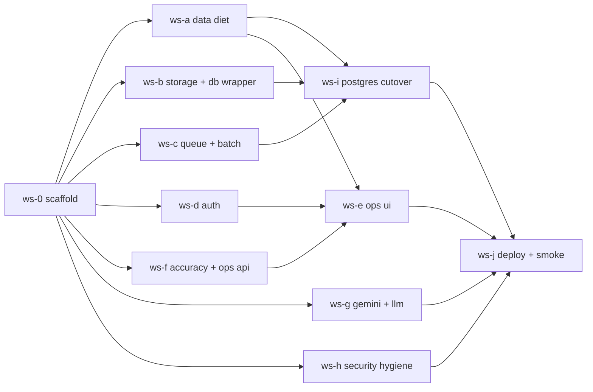

# Production cutover v2: data diet first, then cloud

Status: plan of record. Supersedes v1 of this document (kept in git history).
Execution package: `docs/agents/README.md` (run book),
`docs/agents/00-CONTRACTS.md` (interfaces and budgets), `.opencode/agents/*.md`
(one brief per agent).

## 1. Decisions taken

| Question | Decision |
|---|---|
| Migrate existing SQLite data to Neon? | **No.** Neon starts empty. The current `data/dmef.db` and `data/` folders stay on the laptop as an archive. |
| How do agents run? | **Parallel git worktrees**, one agent per workstream, one PR per workstream, merged in a fixed order. |
| ORM? | **No.** Raw SQL stays; `database/db.py` gains a thin dialect-aware wrapper. |
| JSONB? | **No.** JSON payload columns remain `TEXT`. |
| Object store | Google Cloud Storage (Vision already uses Google ADC). |
| Database | Neon PostgreSQL via `DATABASE_URL`; SQLite remains the test/dev default. |
| Queue | Database table (`pipeline_jobs`) with `FOR UPDATE SKIP LOCKED`; one worker process. No Redis/Celery. |
| Auth | Email + password, admin-provisioned users, roles `admin` / `user`, JWT bearer, httpOnly cookie in the frontend. |
| Hindi | Deterministic EN/HI templates for the nine finding types; Gemini writes only the 2–3 sentence overall summary with a deterministic fallback. |
| Retention | 60 days source files and rows, 7 days generated OCR exports, 30 days telemetry, no durable page images. |
| Page images | Not stored. Rendered on demand from the source PDF (already how `routes/review.py:141-213` works). |

## 2. Why v1's order was wrong: the storage math

Measured on the current laptop database (3.9 GB SQLite, ~30 applications):

| What | Where it is stored today | Size |
|---|---|---|
| Full Google Vision response (`structured_content.native`) | `pages.structured_content`, again in `pipeline_page_events.extracted_fields` (partially), again in the disk export `ocr-export.json` three times over | 60 KB – 103 MB per page, ~135 KB median |
| `extracted_fields` with private `_classification/_triage/_language/_structured_llm_classification` blobs | `pages`, `pipeline_page_events` | 3–20 KB per page |
| `ground_truth.raw_json` (raw company dump) | saved twice per run | ~145 KB per run |
| `reviewer_summaries.summary_json` | one per run, never pruned | ~148 KB avg |
| Rendered page PNGs | `data/pages/{application}/...` | 400–500 MB per application |
| Telemetry (`audit_log`, `ocr_route_events`, `classification_review_log`, `pipeline_jobs`, `pipeline_job_inputs`) | append-only forever | grows with every run |

Per application today: ~170 MB (DB + disk). After the diet: ~1 MB in Neon and
25–50 MB in GCS (the source PDF/ZIP only). At 50 applications a day for a
two-month pilot that is the difference between ~500 GB and ~3 GB Neon + ~120 GB
GCS. Moving the data first and dieting later would also mean paying to store
and later delete unread blobs.

The frontend polls `GET /review/applications/{id}` every 2 seconds while a
job runs (`frontend/lib/queries.ts:42`); that response includes every page's
`ocr_text` and `structured_content`. Payload budgets are therefore part of the
diet, not a later optimisation.

## 3. Target data model

| Table | Change |
|---|---|
| `pages` | Keep `ocr_text`, classification columns, `ocr_confidence`, `ocr_route`. `extracted_fields` = business keys only (≤ 1 KB). **Drop** `structured_content` and `image_path`. Avg row ≤ 4 KB. |
| `pages_meta` (new) | Private per-page JSON (`_classification`, `_triage`, `_language`) ≤ 1.5 KB. Admin-only reads. |
| `pipeline_page_events` | Status, timing, `document_type`. **Drop** `extracted_fields`. |
| `validation_results` | Add `evidence_json TEXT`: `{"page": n, "bbox": [x0,y0,x1,y1], "text": "..."}` in normalized 0–1 coordinates. |
| `ground_truth` | Keep normalized `reference_data`; raw dump goes to object storage `applications/{id}/manifest.json`. Saved once per run. |
| `reviewer_summaries` | ≤ 40 KB avg; remove document index / reconciliation duplicates that are reconstructible. |
| `applications` | Add `ops_summary_en`, `ops_summary_hi`, `ops_findings_json` (≤ 5 KB). |
| `pipeline_jobs` | Add `max_attempts`, `next_run_at`, `failure_reason`, `batch_id`. |
| `llm_calls` (new) | provider, model, purpose, tokens in/out, ms, est_cost_usd, application_id. |
| `users`, `user_passwords` (new) | Auth. |
| `exceptions` | Dropped (dead). |
| Indexes | `pages(application_id, page_number)`, `applications(created_at)`, `reviewer_decisions(decided_at)`, `pipeline_jobs(status, next_run_at)`. |

Object storage keys, budgets and API payload limits are normative in
`docs/agents/00-CONTRACTS.md` §2 and §8.

## 4. Flaws found in the audit and the stream that fixes each

Storage and data model → **ws-a**

- `structured_content.native` is the whole Vision response: built in
  `services/ocr_router.py:459-466` and `:496`, persisted in
  `services/pipeline/persistence.py:62-93`.
- Private blobs inside `extracted_fields` (`services/pipeline/page_processing.py:640-670`),
  duplicated into `pipeline_page_events` (`services/progress_tracker.py:191-243`).
- `services/ocr_json_export.py:361-414` nests each page three times.
- `ground_truth` saved twice (`services/pipeline/orchestrator.py:100,249`).
- `init_db()` (DDL + seed writes) called from ~17 request handlers.
- Missing indexes; append-only telemetry; dead `exceptions` table.

API payload → **ws-a** (backend) and **ws-e** (frontend)

- `SELECT * FROM pages` in `services/review/repository.py:60-63`, spread into the
  review response in `routes/review.py:96-113`, polled every 2 s.

Architecture → **ws-b**, **ws-c**, **ws-h** (rest deferred)

- Routes own SQL and run pipeline tasks (`routes/upload.py:1065-1174`).
- 53 env vars, DB settings with inverted precedence (`services/config.py:192-275`). Deferred.
- God modules: `field_extractor.py` (3428 lines), `consistency_checks.py` (2020),
  `mapped_verification.py` (1941). Deferred; only targeted edits this phase.
- `docs/MAINTAINING.md:37-41` calls these modules "facades"; they are not.

Security → **ws-h**, **ws-d**

- Unauthenticated `POST /shutdown` (`main.py:72`); CORS allows any localhost
  origin with credentials; plaintext secrets in `system_settings`;
  `FileResponse` of a DB-stored path without confinement (`routes/review.py:121-134`);
  auto-generated Fernet key under `data/`; no authentication anywhere.
- Mapped job marks package `completed` even when the pipeline failed
  (`routes/upload.py:1136-1149`) → **ws-c**.

Accuracy and false positives → **ws-f**

- `run_consistency_checks` compares fields from nearly every page; only utility
  bills are skipped (`services/consistency_checks.py:315-328`).
- Generic field extraction runs on photo pages (`services/pipeline/page_details.py:152-192`).
- `{FIELD}_NOT_FOUND` fires from `readable_pages[0]` regardless of classification
  confidence (`services/mapped_verification.py:1047-1081`).
- Legacy date checks use wall clock and `/30` (`services/checklist_engine.py:129-145`, `:1099`).
- Three name matchers with different thresholds; no Devanagari↔Latin path.
- Reviewer collapses items to one page (`services/reviewer.py:395-408`);
  `MISSING_DOC_*` stripped from active anomalies (`services/exception_aggregator.py:86-90`).

Frontend → **ws-e**, **ws-c**

- Demo data in `OverviewTab.tsx:38,44` and `ZipPackageForm.tsx:16-26`.
- Jargon (OCR, deterministic, stale, pipeline, database dump) in operator-facing copy.
- ~574 inline hex colours, empty Tailwind theme; no i18n; review state in `sessionStorage`.

LLM → **ws-g**

- `LLM_PROVIDER=gemini` silently falls back to Ollama (`services/llm_client.py:48-90`)
  while the UI offers Gemini. No token/cost accounting, no retries.
- Project rule `.agents/AGENTS.md` mandates TOON for LLM I/O; the audit found TOON
  parsing brittle. Decision for this phase: TOON for prompt input, JSON for model
  output. `.agents/AGENTS.md` is updated by ws-g to say so.

## 5. Workstreams and waves

| Wave | Stream | Scope in one line | Owned area |
|---|---|---|---|
| 0 | `ws-0-scaffold` | Stubs, registry, router registration, deps, env keys, root `AGENTS.md` | new files only |
| 1 | `ws-a-data-diet` | Stop persisting Vision JSON and private blobs; explicit columns; `/status` + `/pages/{n}/text`; retention; indexes; budget tests | OCR router/Vision output shape, pipeline persistence, review repository, `database/models.py` |
| 1 | `ws-b-storage-db` | `ObjectStore` (local + GCS), db wrapper with `?`→dialect, alembic skeleton, uploads and evidence streaming through the store, Dockerfile, CI Postgres job | `services/storage/`, `database/db.py`, `services/paths.py`, upload save path, source-pdf/page routes |
| 1 | `ws-c-queue-batch` | Durable worker loop, retries with backoff and `failure_reason`, batch upload endpoints, multi-file UI | `services/worker.py`, `services/job_runner.py`, `services/pipeline/tasks.py`, batch routes, `frontend/components/upload/` |
| 1 | `ws-d-auth` | Users, roles, JWT, login page, middleware, admin user management | `services/auth/`, `routes/auth.py`, `routes/admin_users.py`, `frontend/app/login`, `frontend/middleware.ts` |
| 1 | `ws-f-accuracy-ops-api` | Gate checks by document type/triage/confidence; unify name matching; fix date checks; evidence bboxes; nine finding codes EN/HI; `GET /ops/applications/{id}` | consistency checks, page details, mapped verification, checklist engine, reviewer, exception aggregator, `services/ops_presentation.py`, `routes/ops.py` |
| 1 | `ws-g-gemini-llm` | Real Gemini provider, retries, `llm_calls` accounting, EN+HI summary with fallback, model bake-off script | `services/llm_client.py`, `services/llm_gemini.py`, `services/llm_service.py`, `scripts/eval_gemini_models.py` |
| 1 | `ws-h-security-hygiene` | Delete `/shutdown`, `CORS_ORIGINS`, encrypt secrets at rest, fix docs | `main.py`, `routes/settings.py`, `services/config.py`, `services/job_control.py`, `docs/MAINTAINING.md` |
| 2 | `ws-i-postgres-cutover` | Full suite green on Postgres; SQL dialect sweep; alembic baseline; `/health` checks DB; Neon documented | all SQL sites (sweep), `alembic/` |
| 2 | `ws-e-ops-ui` | `/ops` screens, `/admin` move, role-aware shell, EN/HI toggle, bbox highlight overlay, polling `/status` only, jargon and demo-data removal, Tailwind tokens | `frontend/app/ops`, `frontend/app/admin`, `AppShell`, `queries.ts`, `i18n/` |
| 3 | `ws-j-deploy-smoke` | Cloud Run API + worker, secrets, `/health` with worker heartbeat, smoke script, retention schedule, pilot metrics | `Dockerfile`, `deploy/`, `scripts/smoke_batch.py`, `docs/agents/PILOT_METRICS.md` |
| — | `reviewer` | Read-only: checks each PR against contracts, budgets, ownership | none |

Merge order: 0 → H → A → B → C → D → F → G → I → E → J.

## 6. Acceptance for "production-ready v1"

- A 10-file batch uploaded from the UI enqueues 10 jobs; the worker processes
  them one at a time; each application becomes reviewable as soon as it finishes;
  a job failing three times shows `failed` with a readable reason.
- Operations user (role `operations`) sees: summary (EN/HI), ≤ 5 findings,
  pages to verify, checklist in the familiar format, click-through to the page
  with the mismatch highlighted; never sees OCR text, JSON, rule IDs or stage names.
- Admin sees everything the current UI shows, plus user management, job
  control, LLM settings and cost.
- Neon holds ≤ ~1 MB per application; GCS holds only source files and
  short-lived exports; no page images anywhere durable.
- All routes except `/health` and `/auth/login` require a valid token.
- Gemini is the LLM provider with per-call token and cost accounting; a
  bake-off CSV exists for at least two Gemini models on the fixture set.
- `python -m pytest -q` is green on SQLite and on PostgreSQL in CI.

## 7. Calendar

| Dates | Work |
|---|---|
| Sep 4–5 | Wave 0, Wave 1 launched |
| Sep 5–7 | Wave 1 merged in order |
| Sep 7–10 | Wave 2 |
| Sep 10–11 | Wave 3, infra provisioning, smoke on fixtures → production-ready build |
| Sep 15 | Live deployment, pilot start (two operations users, one admin) |
| Sep 15 – Nov 15 | Pilot: track processing time, accuracy, false positives, manual-review effort, failure rate (`docs/agents/PILOT_METRICS.md`) |

Out of scope for this phase: overnight scheduler beyond the retention job,
PWS work, credit scoring, env-var consolidation, god-module refactors.
