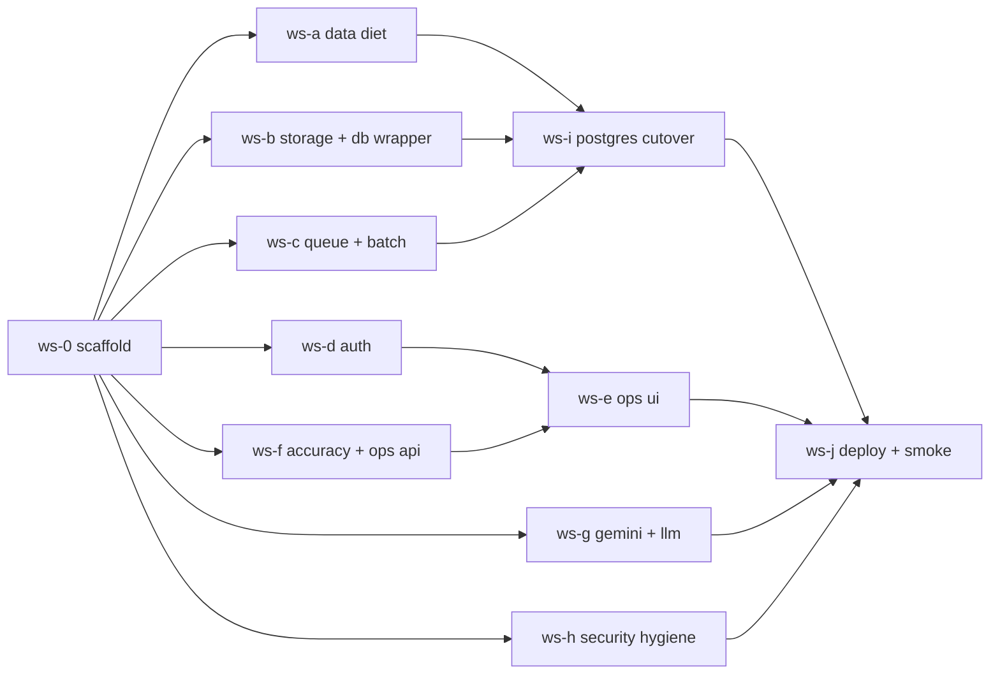

# Run book: executing the production cutover with opencode agents

This folder plus `.opencode/agents/` is the complete hand-off package.
You (the human) do the steps below; each agent does the work in its brief.

## What is where

| Path | Purpose |
|---|---|
| `docs/PRODUCTION_NEXT_PHASE.md` | The plan (v2): why, what, in which order, with the storage math |
| `docs/agents/00-CONTRACTS.md` | Interfaces, budgets, env vars, SQL rules, PR template. Every agent reads it first |
| `docs/agents/README.md` | This run book |
| `.opencode/agents/ws-*.md` | One brief per workstream = one opencode agent = one worktree = one PR |
| `.opencode/agents/reviewer.md` | Read-only agent that checks a PR against the contracts |

## Waves and merge order



- **Wave 0** (1 agent, ~1 hour): `ws-0-scaffold`. Merge before anything else.
- **Wave 1** (7 agents in parallel): `ws-a`, `ws-b`, `ws-c`, `ws-d`, `ws-f`, `ws-g`, `ws-h`.
  Merge order when they finish: **H → A → B → C → D → F → G**. H first because
  it is small and touches `main.py`; A next because it changes the schema
  everyone else's tests run against.
- **Wave 2** (2 agents in parallel): `ws-i-postgres-cutover` (needs A, B, C) and
  `ws-e-ops-ui` (needs D, F). Merge I then E.
- **Wave 3** (1 agent): `ws-j-deploy-smoke`.

Run `reviewer` on every PR before merging.

## One-time setup

```bash
cd document-validation-mvp
git checkout main && git pull
python3.11 -m venv .venv && source .venv/bin/activate
pip install -r requirements.txt && pip install ruff pytest
npm --prefix frontend ci
python -m pytest -q          # must be green before you start
```

The briefs use the `permission:` map syntax in frontmatter (only `reviewer.md`
sets one). If your opencode version expects the newer `permissions:` list
syntax, convert that one block; the stream briefs have no permission block and
run with your defaults.

Set the model in each brief's frontmatter if you do not want the opencode
default. For Muse Spark 1.3 add a line like `model: <provider>/<model-id>` using
whatever provider id your opencode config exposes (`opencode models` lists them).

## Launching a wave

For each stream in the wave, from the repo root:

```bash
STREAM=ws-a-data-diet          # the brief file name without .md
git worktree add ../wt-$STREAM -b $STREAM main
cd ../wt-$STREAM
python3.11 -m venv .venv && source .venv/bin/activate && pip install -r requirements.txt ruff pytest
npm --prefix frontend ci
opencode --agent $STREAM
```

Then paste this as the first message:

```text
Read .opencode/agents/<STREAM>.md and docs/agents/00-CONTRACTS.md fully, then
execute the brief end to end. Work only in this worktree. When done, run the
verification commands, commit on this branch, and print the PR description
using the template in the contracts file. Do not open the PR yourself.
```

Agents run in separate terminals and separate worktrees; they never touch each
other's files. Agents do **not** push or open PRs; you do, so you control the
merge order.

## Merging a stream

```bash
cd ../wt-$STREAM
python -m pytest -q && ruff check . && npm --prefix frontend run typecheck && npm --prefix frontend run lint && npm --prefix frontend test
git push -u origin $STREAM
gh pr create --base main --head $STREAM --title "$STREAM" --body-file /dev/stdin   # paste the agent's PR description
```

Run the reviewer against it:

```bash
cd document-validation-mvp && git fetch && git checkout $STREAM
opencode --agent reviewer
# first message: "Review the diff of this branch against main using the checklist in your brief. Report BLOCK / WARN / OK items."
```

Fix blocks by resuming the stream agent in its worktree with the reviewer's
output pasted in. Merge with `gh pr merge --squash`. After each merge, rebase the
remaining open worktrees:

```bash
cd ../wt-<other-stream> && git fetch origin && git rebase origin/main
```

Conflicts should only appear in the shared-append files (`main.py`,
`requirements.txt`, `.env.example`, `frontend/lib/api.ts`, `database/__init__.py`);
keep both sides.

## When an agent writes NEEDS-COORDINATION

That is the agent stopping instead of guessing. Read the section, decide, then
either update `docs/agents/00-CONTRACTS.md` on `main` (and tell the other agents
to rebase) or reply to the agent with the decision. Common cases and default answers:

| Situation | Default answer |
|---|---|
| Agent wants a new column | Yes if additive and documented in the PR; the SQLite `models.py` and Postgres alembic migration must both get it (ws-i owns alembic; note it for them) |
| Agent wants to change a contract signature | No unless the current one is impossible; prefer adding a new function |
| Credentials missing (GCS, Neon, Gemini) | Implement, `skipif` the integration test, continue |
| Test outside the stream fails | Check if `main` already fails; otherwise the stream broke it and must fix or explain |

## After Wave 3

- Provision: GCS bucket (private, uniform access), Neon project, Cloud Run
  service (API), Cloud Run job or always-on worker, Cloud Scheduler for
  retention (daily 02:00 IST).
- Fill the `.env` values listed in `docs/agents/00-CONTRACTS.md` §7.
- Run the smoke checklist from `ws-j` on the real fixture set.
- Start the pilot with two operations users and one admin.

## Time budget (calendar)

| Day | Activity |
|---|---|
| D0 | Setup, Wave 0 |
| D0–D2 | Wave 1 in parallel; merge as they finish |
| D2–D4 | Wave 2 |
| D4–D5 | Wave 3, infra provisioning, smoke |
| D5–D6 | Pilot start |

Sep 4 start → first production-ready build Sep 10, deploy Sep 15 is achievable
if Wave 1 lands by Sep 7.
